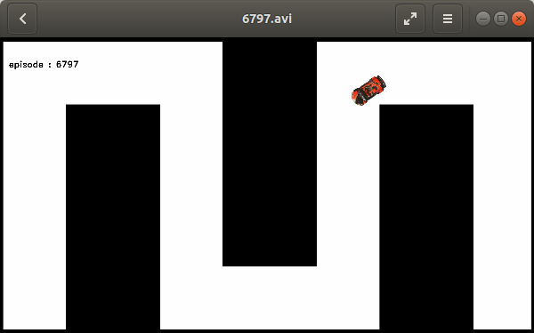
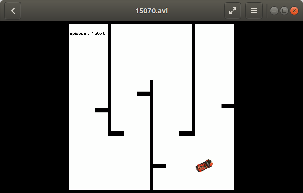

# Programmers Autonomous-Driving Dev course. Driving Simulator with DQN

## Video
---

 

## Member Roles

| 이름         | 담당                                         |
| ------------ | :------------------------------------------- |
| 조영진(팀장) | DDQN 알고리즘을 이용한 모델 학습 및 reward 구현 |
| 구민상       | DQN알고리즘을 이용한 모델 학습 및 reward 구현 |
| 고세람       | DQN알고리즘을 이용한 모델 학습 및 reward 구현 |
| 임경묵       | Duel DQN 알고리즘을 이용한 모델 학습 및 reward 구현 |

## Goal
---
   
- 거리센서 정보를 사용할 수 있는 시뮬레이터에서 강화학습 DQN 기반으로 학습을 시켜서 자동차와 벽과 충돌하지 않고 죽지 않고 살아남도록 만들기

## Environment
---
- Ubuntu 18.04
- ROS Melodic
- pytorch v1.2
- pyglet v1.4.11
- visdom v0.1.8.9
- pygame v1.9.6
- dill v0.3.3

~~~bash
$ pip install torch==1.2.0+cpu torchvision=0.4.0+cpu -f https://download.pytorch.org/whl/torch_stable.html
$ pip install visdom 
$ pip install pygame==1.9.2
$ pip install pyglet==1.4.11 --upgrade
~~~

## Structure
---
~~~
Project3
  └─ src
  │    └─ main_action.py         # xycar drive main code
  │    └─ main_vector.py         # video drive main code
  │    └─ my_reward_action.py    # imageProcessing Module
  │    └─ my_reward_vector.py    # PID Module
  │    └─ viewer.py              # pth 파일의 시험 주행을 위한 파일
  └─ env                          # 학습 시뮬레이터 환경
  └─ map                          # 차량이 주행할 map 파일들이 있는 폴더
  └─ save                         # 학습시킨 episode 중 가장 높은 score 값을 가졌을 때의 weight 파일이 .pth 파일로 저장되는 폴더
  └─ video                        # 학습시킨 episode 중 가장 높은 score 값을 가졌을 때의 주행 영상이 동영상 파일로 저장되는 폴더
~~~

## Procedure
---
### 학습하기
#### 1. How to use
- action으로 학습하기
~~~
$ cd src
$ python main_action.py
~~~  
- vector로 학습하기
~~~
$ cd src
$ python main_vector.py
~~~  

#### 2. main (main_action.py, main_vector.py)
- hyper_param  
  - sensor_num
    - 학습 시 라이다 센서를 몇 개 볼 것인지 개수 입력  
  - learning_rate
    - 학습률 (gradient discent에서 얼마 간격으로 내려갈 것인지)  
  - discount_factor
    - Gamma 값  
  - optimizer_steps
    - 학습 시 batch 만큼 학습 반복 횟수  
  - batch_size
    - 경험들 중에서 뽑아낼 개수  
  - min_history
    - 최소 경험의 limit  
  - buffer_limit
    - 최대 경험의 limit  
  - max_episode
    - 에피소드 진행 횟수  
  - update_cycle
    - 메인 스트랩에서 부트 스트랩으로 이전하는 간격의 업데이트 사이클  
  - hidden_size
    - hidden layer의 각 노드의 수  
  - min_score
    - 학습 시 최소 score  
  - max_score
    - 학습 시 최대 score (과적합 방지)

- network
  - DQN
  - DDQN
  - Duel DQN

- epsilon
  - 일정한 확률로 랜덤으로 모험할 비율을 선택하는 것 (일정한 확률은 Random, 일정한 확률은 이전 최상의 결과를 냈던 행동 선택)

### REWARD
#### 1. action (my_reward_action.py)
- reward 설정을 action으로 설정
  - action 0: 좌회전
  - action 1: 직진
  - action 2: 우회전
  - action 3: 왼쪽으로 후진
  - action 4: 후진
  - action 5: 오른쪽으로 후진
  - action 6: 정지

#### 2. vector (my_reward_vector.py)
- 라이다 센서에서 가져온 550개의 값을 360도에 맞게 변환
- 라이다 값의 뒷편은 차량으로 가리기 때문에 0~180 값만 사용
- 라이다가 측정할 수 있는 거리는 최대 값(inf로 리턴)이 존재하기 때문에 좌우 거리 값을 비교하여 가장 작은 값을 inf 값 대신 넣기
- 코너를 돌 때, 차량이 코너에 걸리는 상황을 방지하기 위해서 차가 중심을 맞춰서 주행할 수 있도록 학습
- 중심을 맞추기 위해서 라이다 값으로 계산된 방향과 지금 주행하고 있는 방향을 비교해서 그 차이를 0과 1 사이의 값으로 환산해서 reward 설정
- 지금 주행하고 있는 방향은 차량의 현재 바퀴 각도로 판단
- 라이다 값으로 계산된 방향은 arcsin(x 성분 평균 / 평균 벡터 거리)

### 시험 주행
#### 1. How to use
~~~
$ python viewer.py
~~~ 
#### 2. viewer.py  
- Line 9: hidden_layer = [..., ...]
  - 학습시에 사용한 main.py >> hidden_size 파라미터와 똑같이 입력함  
- Line 10: lidar_cnt = ...
  - 학습시에 센서의 개수를 입력  
- Line 14: state_select = ...
  - 학습시에 사용한 데이터의 종류 체크
  - car sensor: 거리 센서
  - car yaw: 자동차 방향
  - car position: 자동차 좌표
  - car steer: 자동차 조향값  
- Line 23: xycar.ML_init("...")
  - 학습시에 사용한 모델의 종류 기입
  - DQN, DDQN, Duel DQN  
- Line 25: view_epi = ...
  - 저장된 학습파일의 에피소드 넘버 입력

## Try
---
#### 1. Network 변경
- DQN보다 DDQN이나 Duel DQN을 사용했을 때, 더 성능이 올라감 
- DDQN이나 Duel DQN에서는 큰 성능 차이를 발견하지 못함  

#### 2. epsilon 조정
- episode 증가할 때마다 조금씩 감소
- 고정값 사용

#### 3. reward 변경
- 기존의 전진, 좌회전, 우회전 총 3개의 action에서 전진, 좌회전, 우회전, 정지, 후진 총 5개의 action으로 부터 reward를 받는 것으로 수정하니 학습이 더 잘 되었음
- 리워드 값은 최대한 간단명료하게 짜는 것이 학습효과가 좋았음
- 벡터를 이용한 방법이 가장 효과가 좋았음.

## Limitations
---
- xytron에서 제공된 틀을 받아서 시뮬레이션을 진행했기 때문에, 학습 네트워크에 사용한 network를 직접 구현하지 못함.
- DQN, DDQN, Duel DQN 외의 다른 강화학습 네트워크를 사용해보지 못함

## What I've learned
---
- 학습 네트워크에 사용한 network를 직접 구현하지 못했지만 hyper parameter 조정을 통해서 network의 구조를 다뤄보았음
